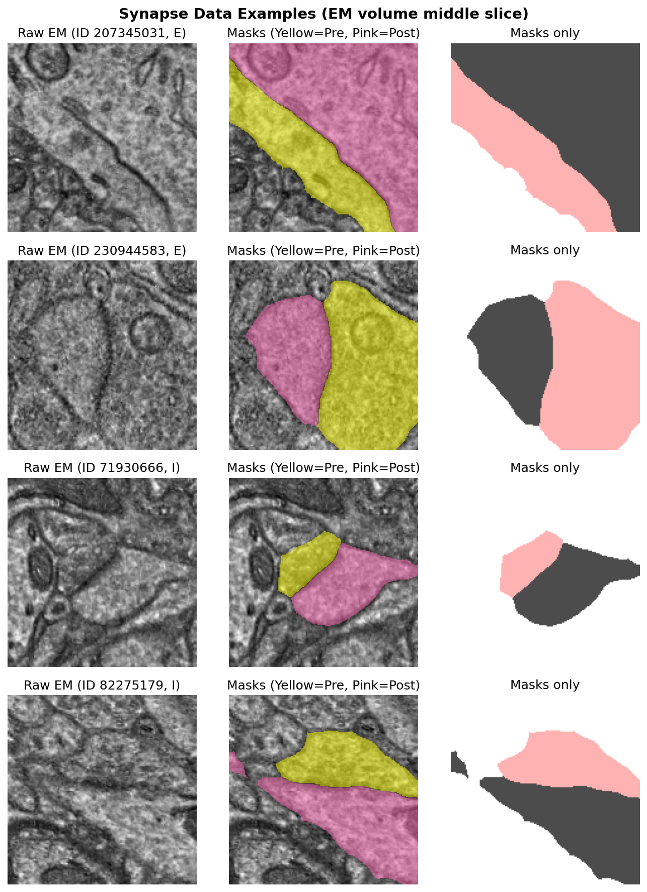
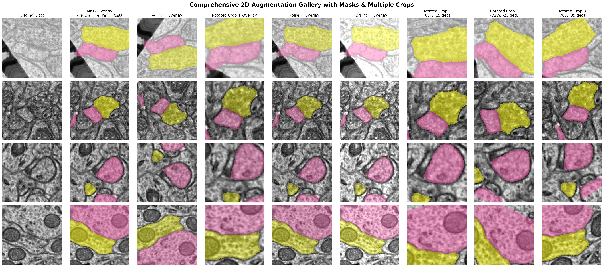
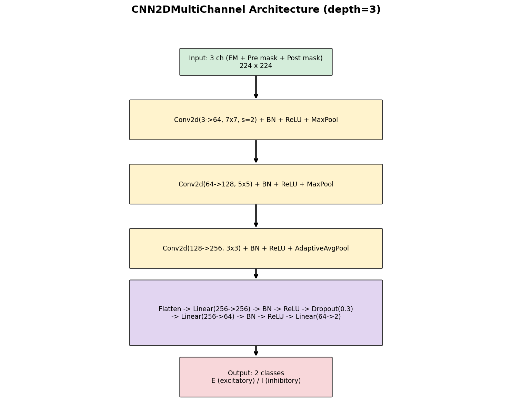
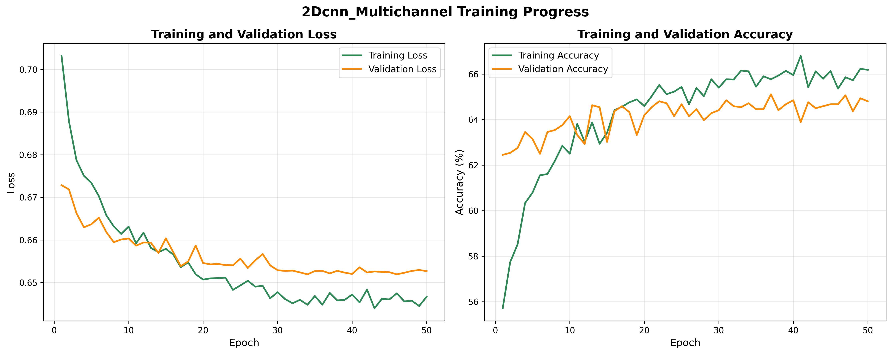
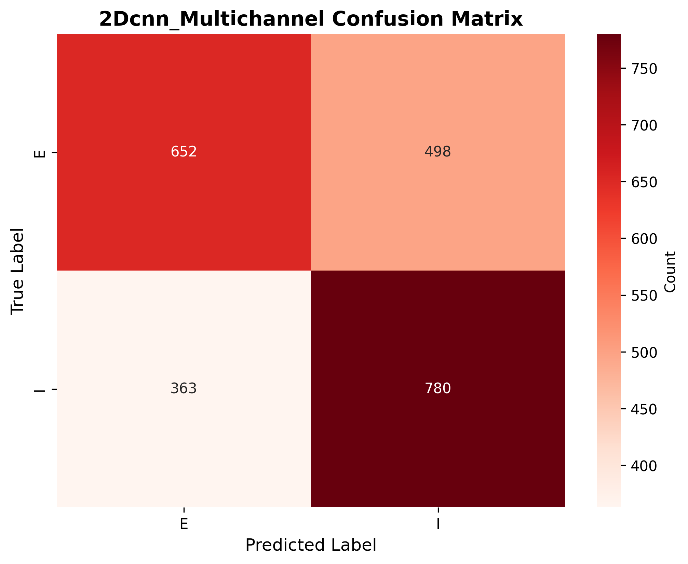

# SynClass

Synapse classifier for electron microscopy (EM) volumes: predicts **excitatory (E)** vs **inhibitory (I)** synapse type from 3D EM crops and pre/post-synaptic masks.

## Overview

SynClass uses a 2D CNN with multi-channel input: the EM image plus pre- and post-synaptic segmentation masks. The model learns to classify synapses from 2D projections (middle slice + augmentations) of 3D volumes.

## Data

Each synapse is a 3D volume with:
- **Raw EM** (`*_syn.npy`): grayscale intensity
- **Pre-synaptic mask** (`*_pre_syn_n_mask.npy`): pre-synaptic compartment
- **Post-synaptic mask** (`*_post_syn_n_mask.npy`): post-synaptic compartment

Labels come from `synapse_data.csv` (`id_`, `pre_clf_type`).

### Data Examples

Raw EM (middle slice), mask overlay, and masks only:



### Augmented Data

Training uses random augmentations: flips, rotations, crops, noise, brightness. One random augmentation per synapse per epoch.



## Architecture

The default model is `CNN2DMultiChannel` with depth 3:



- **Input**: 3 channels (224x224): EM image + pre mask + post mask
- **Conv blocks**: 3 blocks (64 -> 128 -> 256 filters), BatchNorm, ReLU, pooling
- **Classifier**: FC(256) -> FC(64) -> 2 classes
- **Output**: E (0) or I (1)

## Training

```bash
# Full training (50 epochs)
python synapse_classifier_2dcnn_multichannel.py --epochs 50 --batch_size 32

# Quick test (2 epochs)
python synapse_classifier_2dcnn_multichannel.py --epochs 2 --batch_size 32
```

### Results

After training, curves and confusion matrix are saved to `figures/`:





*Run `python synapse_classifier_2dcnn_multichannel.py --epochs 50` to generate these.*

## Setup

```bash
pip install -r requirements.txt
```

Data can be:
- Extracted to `Data/synpase_raw_em/`
- Or kept as `Data/synpase_raw_em.7z` (loaded on-the-fly)

## Generate README Figures

```bash
python scripts/generate_readme_figures.py
```

Creates: `data_examples.png`, `comprehensive_2d_augmentation_gallery.png`, `architecture_diagram.png`.  
Run training for accuracy curves.

## Project Structure

```
SynClass/
  synapse_classifier_2dcnn_multichannel.py   # Main classifier
  data_loader.py                             # Train/test split, metadata
  data_utils.py                              # Load from disk or 7z
  datasets.py                                # Dataset classes
  augmentation.py                            # 2D/3D augmentations
  training.py                                # Training loop
  plotting.py                                # Curves, confusion matrix
  constants.py                               # Paths, config
  scripts/generate_readme_figures.py          # README figure generation
  figures/                                   # Output figures
```
