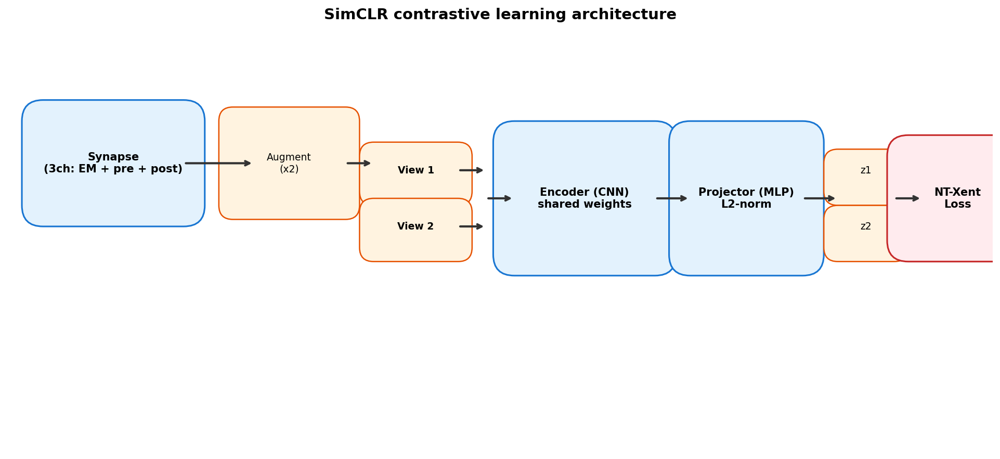
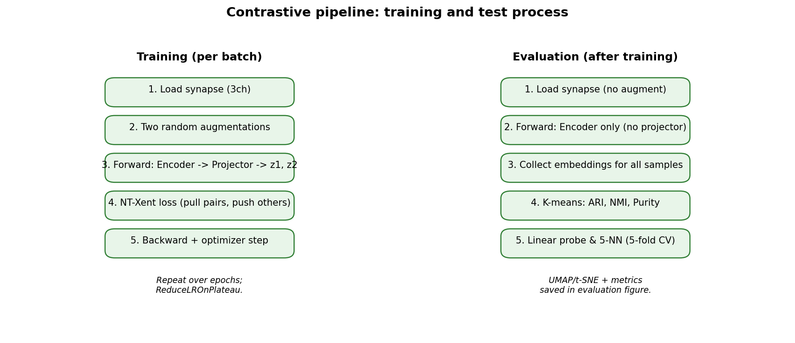
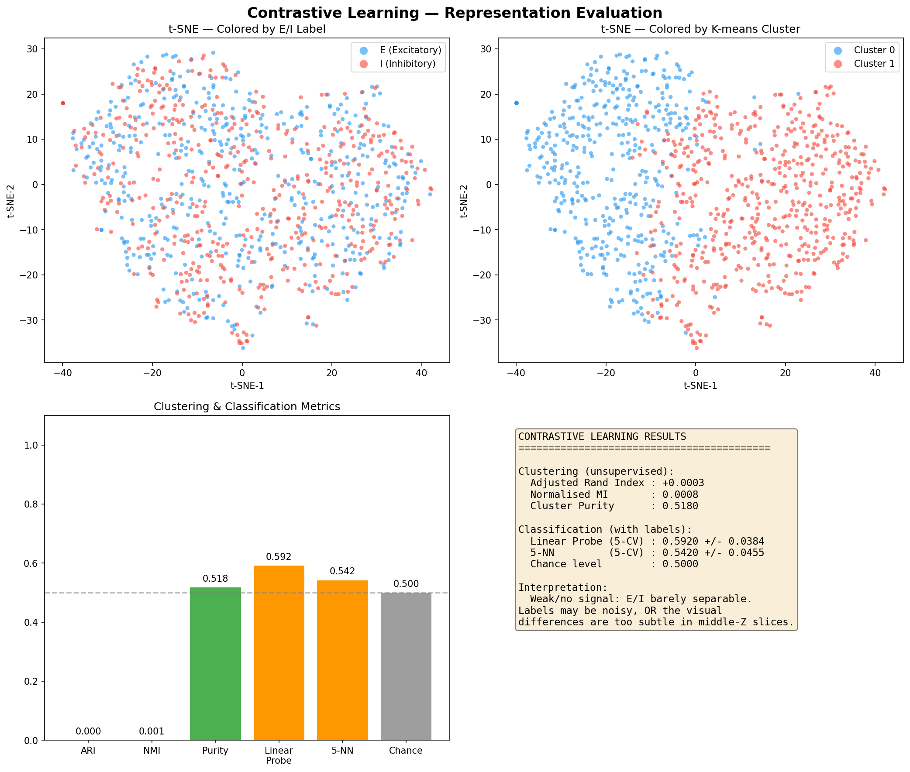
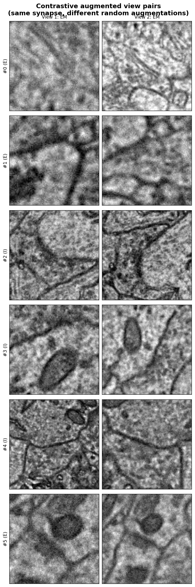
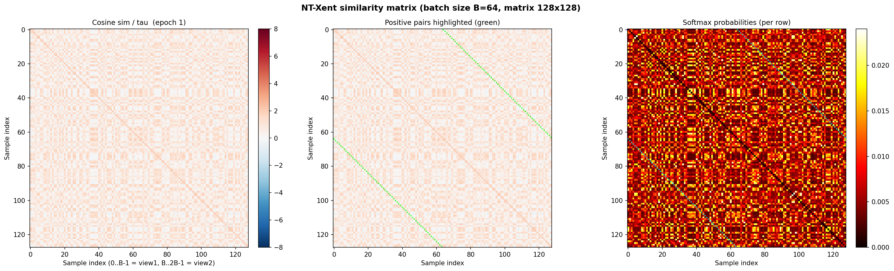
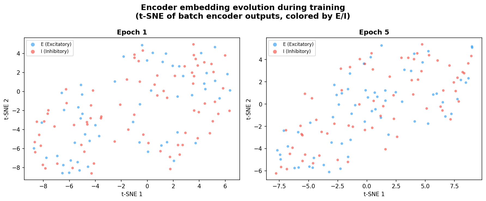
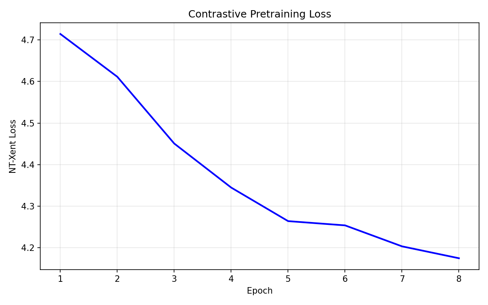
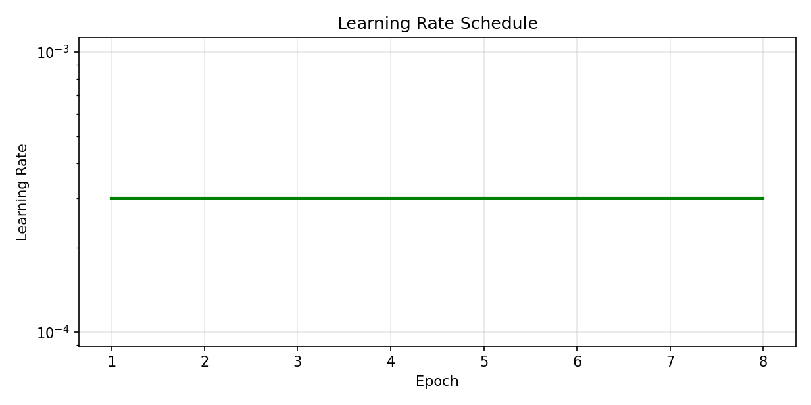

# Contrastive Learning (SimCLR) for Synapse Classification

## Goal

Determine whether excitatory (E) and inhibitory (I) synapses are visually
distinguishable **without using labels during training**. If a model trained
only to pull similar views together and push different synapses apart can still
separate E from I, the signal is real and the bottleneck is in the supervised
training strategy, not in the data.

---

## Architecture



The model has two parts that are trained jointly:

| Component | Details |
|-----------|---------|
| **Encoder** | The CNN feature extractor from `CNN2DMultiChannel` (depth configurable: 1/2/3/5 conv blocks). Dropout is disabled (0.0) because contrastive learning acts as its own regularizer. Output is a flat feature vector (e.g. 256-d for depth 3). |
| **Projector** | A small MLP head (Linear -> BatchNorm -> ReLU -> Linear) that maps the encoder output down to a low-dimensional projection space (default 64-d). Projections are L2-normalized before the loss. |

The projector is only used during pretraining. At evaluation time only the
encoder is kept -- the idea is that the encoder learns general features while
the projector absorbs task-specific (contrastive) noise.

### Input

Each synapse is a 3-channel 2D image:

1. **EM channel** -- the raw electron microscopy grayscale image (middle Z-slice).
2. **Pre-synaptic mask** -- binary mask of the presynaptic neurite.
3. **Post-synaptic mask** -- binary mask of the postsynaptic neurite.

All three are resized to 224x224 and stacked into a (3, 224, 224) tensor.

---

## Training Process



### How one training step works

1. **Sample a synapse** from the dataset.
2. **Create two different augmented views** of that same synapse. Each view
   gets a random combination of:
   - Random flips (horizontal and vertical)
   - Random rotated crop (scale 0.5--1.0, rotation +/-45 deg)
   - Brightness and contrast jitter (EM channel only)
   - Gaussian blur, 50% chance (EM channel only)
   - Gaussian noise (EM channel only)

   The masks get the same geometric transforms but none of the intensity
   transforms -- this keeps the structural information intact.

3. **Forward pass**: both views go through the **same** encoder and projector
   (shared weights), producing projection vectors `z1` and `z2`.

4. **NT-Xent loss** (Normalized Temperature-scaled Cross-Entropy):
   - Build a (2B x 2B) cosine-similarity matrix for the whole batch
     (B = batch size, so 2B vectors total from both views).
   - Divide by a temperature parameter (default 0.5).
   - Mask out the diagonal (a vector's similarity with itself).
   - For each vector, the **positive pair** is its other augmented view;
     every other vector in the batch is a **negative**.
   - Apply cross-entropy so the model learns to score the positive pair
     highest.

   In short: the loss **pulls** two views of the same synapse together and
   **pushes** views of different synapses apart, all in the projection space.

5. **Backward + optimizer step** (AdamW with weight decay).

6. **Learning rate schedule**: `ReduceLROnPlateau` monitors the loss and
   halves the LR after 10 epochs without improvement (min LR = 1e-6).

### Why this works

The model never sees E/I labels. It just learns "what makes two views of the
same synapse similar, and what makes different synapses different." If E and I
synapses genuinely look different, the learned features will naturally cluster
by type -- even though the model was never told which is which.

---

## Evaluation Process

After training, we freeze the encoder and evaluate the quality of its
representations:

### 1. Embedding extraction

Every synapse is passed through the encoder **once** (no augmentation, no
projector). This gives one 256-d feature vector per synapse.

### 2. Unsupervised metrics (no labels used)

| Metric | What it measures |
|--------|-----------------|
| **K-means (k=2)** | Cluster the embeddings into 2 groups and compare with true E/I labels. |
| **Adjusted Rand Index (ARI)** | Agreement between K-means clusters and true labels, adjusted for chance (0 = random, 1 = perfect). |
| **Normalized Mutual Information (NMI)** | Shared information between clusters and labels, normalized to [0, 1]. |
| **Purity** | Fraction of samples whose cluster's majority class matches their true label. |

### 3. Supervised metrics (labels used, but model was NOT trained on them)

| Metric | What it measures |
|--------|-----------------|
| **Linear probe (5-fold CV)** | Fit a logistic regression on the frozen embeddings. If a simple linear classifier can separate E/I, the encoder has learned useful features. |
| **5-NN (5-fold CV)** | Classify each synapse by majority vote of its 5 nearest neighbors in embedding space. Tests local structure. |

### 4. Visualization

Embeddings are projected to 2D with UMAP (or t-SNE if UMAP is unavailable)
and plotted:

- Colored by **true E/I label** -- do E and I form separate clusters?
- Colored by **K-means cluster** -- does unsupervised clustering align with
  the true labels?

---

## Interpreting the Results



| Outcome | What it means |
|---------|--------------|
| **ARI > 0.3 and linear probe > 70%** | Strong signal. E/I are visually distinguishable. The supervised model's low accuracy is a training problem (architecture, augmentation, hyperparameters), not a data problem. |
| **Linear probe 60--70%** | Moderate signal. Some E/I separation exists but it's weak. Consider stronger augmentation, more data, or multi-slice input. |
| **Linear probe near 50%** | Weak or no signal. Either the visual difference is too subtle in middle-Z slices, or the labels themselves are noisy. |

---

## Augmented View Pairs



Shows 6 synapses with their two randomly augmented views side-by-side. Each
row shows one synapse; the left 3 columns are View 1 (EM, Pre mask, Post mask)
and the right 3 columns are View 2. The geometric transforms (crop, rotation,
flip) apply to all channels, while intensity transforms (jitter, blur, noise)
only affect the EM channel. This is what the model must learn to match.

---

## Similarity Matrix (2B x 2B)



The core of the NT-Xent loss. For a batch of B synapses, the model produces
2B projection vectors (one per view). The 2B x 2B matrix shows:

| Panel | What it shows |
|-------|--------------|
| **Left: raw cosine sim / tau** | The full temperature-scaled similarity matrix. Block structure: top-left and bottom-right are within-view similarities; off-diagonal blocks are cross-view. |
| **Middle: positive pairs** | Same matrix with green markers on the positive pairs -- position (i, i+B) and (i+B, i). The loss trains the model to make these the highest values in each row. |
| **Right: softmax probabilities** | Per-row softmax (what cross-entropy actually operates on). Cyan markers show the target. A well-trained model concentrates probability mass on the positive pair (bright spots at the markers). |

Saved at epochs 1, mid, and final so you can see the matrix sharpen over training.

---

## Embedding Evolution



t-SNE of the encoder's output (before the projector) at snapshot epochs. Each
point is one view from a batch, colored by E/I label. Early epochs should look
like a random blob; later epochs should show some separation if E and I are
visually different.

---

## Loss Curve



The NT-Xent loss should decrease over epochs. A healthy curve drops steeply in
the first ~20 epochs and then gradually levels off. If the loss plateaus very
early or doesn't decrease, the augmentations may be too weak (views are too
easy to match) or the batch size may be too small (not enough negatives).

---

## Learning Rate



The LR schedule over training. Uses ReduceLROnPlateau (halves LR after 10
epochs without improvement). If the LR drops early, the model may have
converged or gotten stuck.

---

## Running

```bash
# Full training (all ~25k synapses, 100 epochs)
python synapse_contrastive.py --epochs 100

# Quick smoke test
python synapse_contrastive.py --epochs 2 --max_samples 128

# Key arguments
#   --epochs         Training epochs (default 100)
#   --batch_size     Batch size (default 64)
#   --temperature    NT-Xent temperature (default 0.5)
#   --lr             Learning rate (default 3e-4)
#   --cnn_depth      Encoder depth: 1, 2, 3, or 5 (default 3)
#   --max_samples    Cap number of samples for quick runs
#   --cpu            Force CPU even if CUDA is available
```

The encoder weights are saved to `saved_models/contrastive_encoder.pth` and
can later be loaded as a pretrained backbone for the supervised classifier.
